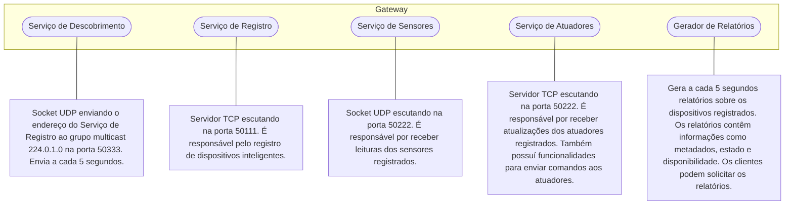
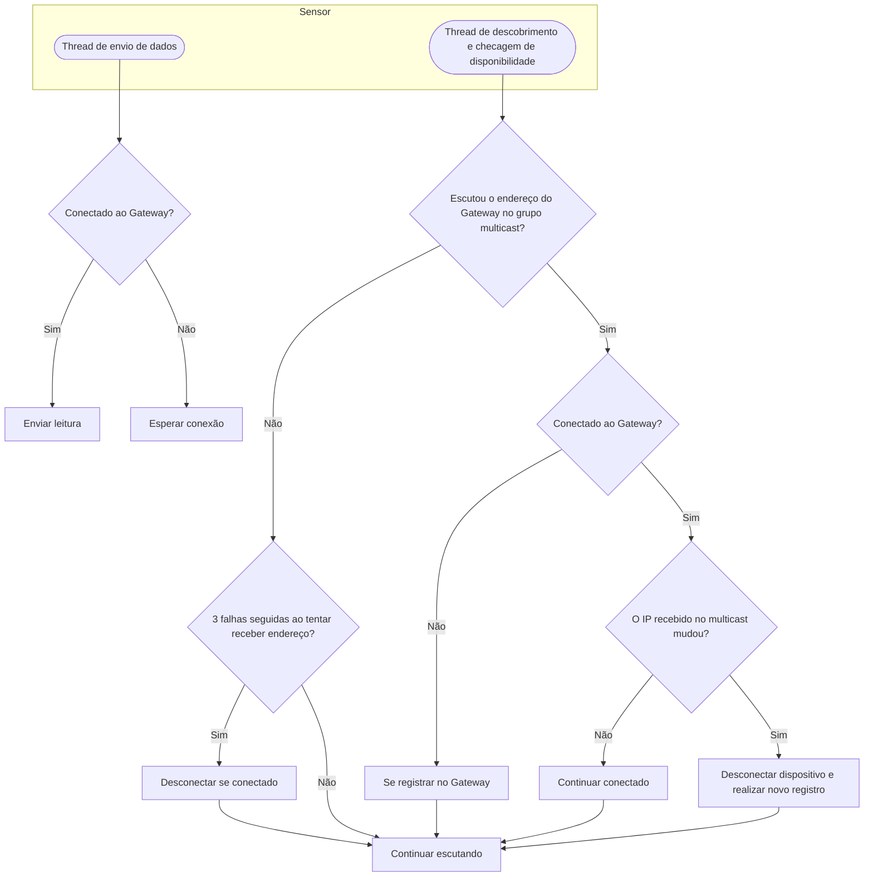
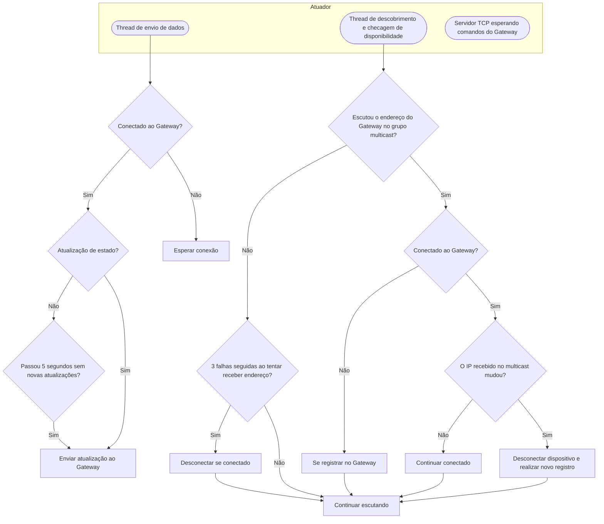

# 🌐 Cidade Inteligente - Sistemas Distribuídos com Sockets
Este projeto simula uma Cidade Inteligente com sensores e atuadores que se comunicam com um Gateway central. Foi desenvolvido um cliente CLI que permite o monitoramento e controle dos dispositivos inteligentes.


## 🧠 O que é?

Um sistema distribuído para aprendizado de comunicação entre processos. Ele simula:

- **Dispositivos Inteligentes:** sensores e atuadores que interagem com o ambiente.
- **Gateway Central:** responsável pela coordenação e comunicação entre dispositivos.
- **Cliente CLI:** interface de controle e monitoramento em tempo real.

## 🔧 Tecnologias Utilizadas

- **Ubuntu-24.04:** os sockets foram configurados tendo em mente uma plataforma Unix;
- **Python v3.12.3:** desenvolvimento do gateway, cliente CLI, sensor de temperatura e semáforo (atuador);
- **Node.js v20.18.2:** poste de iluminação (lâmpada inteligente);
- **Sockets TCP e UDP:** comunicação entre dispositivos;
- **UDP Multicast:** dispositivos inteligêntes descobrem a localização do gateway usando um grupo multicast;
- **libprotoc v31.1:** compilação das mensagens `.proto`.

## 📦 Estrutura de Diretórios

```
cidade_inteligente/
├── clients/
│   └── simple_client/      # Cliente CLI Python
├── devices/                # Código dos dispositivos inteligentes
│   ├── lamp_node/          # Lâmpada inteligente em Node.js
│   ├── semaphore/          # Semáforo em Python
│   └── temp_sensor/        # Sensor de temperatura em Python
├── exemplos/               # Code snippets
├── gateway/                # Código do Gateway em Python
│   ├── gateway.py               # Entry-point do Gateway
|   ├── db.py                    # Abstração de um banco de dados
|   ├── registration_handler.py  # Módulo responsável pelo multicast e registro de dispostivos
|   ├── sensors_handler.py       # Módulo responsável pelos sensores
|   ├── actuators_handler.py     # Módulo responsável pelos atuadores
|   └── clients_handler.py       # Módulo responsável pelos clientes
├── protos/                 
│   └── messages.proto       # Mensagens do Protobuf
├── python-requirements.txt  # Lista de dependência Python
└── README.md                # Documentação principal
```

## Diagramas de funcionamento






## ▶️ Como Executar

### 1. Compilar o arquivo de mensagens

```bash
$ cd protos/
$ protoc --version
libprotoc 31.1
# Python
$ protoc --python_out=. --pyi_out=. messages.proto
# Node.js
$ protoc --js_out=import_style=commonjs,binary:. messages.proto
```

### 2. Rodar os processos

**Python:**
```bash
$ cd cidade_inteligente/
$ python3.12 -m venv venv
$ source venv/bin/activate
(venv) $ pip install -r python-requirements.txt
(venv) $ python gateway/gateway.py --help
```
ou
```bash
(venv) $ python devices/semaphore/semaphore.py --help
```
ou
```bash
(venv) $ python devices/temp_sensor/temp_sensor.py --help
```
ou
```bash
(venv) $ python clients/simple_client/simple_client.py
>>> help
```

**Node.js:**
```bash
$ cd cidade_inteligente/
$ npm install protobufjs
$ node devices/lamp_node/lamp.js
```
